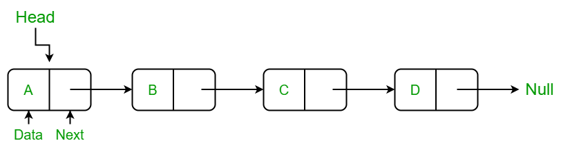
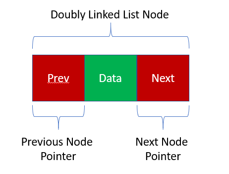

# *链表*
****

## 单链表

> 结构代码：(C++)
> ```c++
> class Node
> {
> public:
>      NumType val;
>      Node *next;
>
>      // 常用构造函数
>      Node(int x): val(x), next(nullptr) {}
>      Node(int x, Node *next): val(x), next(next) {}
>      Node(): val(0), next(nullptr) {}
> }；
> ```

## 双链表


## 循环链表

## 应用