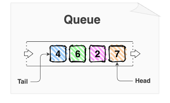
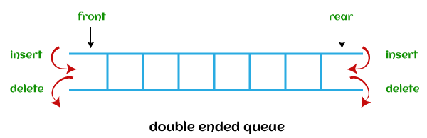

# _队列（FIFO）_

---



## Contents

- [_队列（FIFO）_](#队列fifo)
  - [Contents](#contents)
  - [队列类型](#队列类型)
  - [队列 STL](#队列-stl)
  - [双端队列 STL](#双端队列-stl)
  - [数组实现基本队列](#数组实现基本队列)
  - [链表实现基本队列](#链表实现基本队列)
  - [应用](#应用)
  - [参考资料](#参考资料)

## 队列类型

- 循环队列：按照 FIFO（First In First Out）原则进行操作，最后一个位置连接回第一个位置形成一个圆圈。
- 双端队列：一种插入和删除操作在两端（前端和后端）进行的队列数据结构。
- 优先队列：
  - 升序优先队列：可以任意插入元素，只能移除最小的元素。例如，假设有一个数组，其中元素 4、2、8 的顺序相同。因此，在插入元素时，插入将按相同的顺序进行，而在删除时，顺序将为 2、4、8。
  - 降序优先队列：可以任意插入元素，但只能先从给定队列中删除最大的元素。例如，假设有一个数组，其中元素 4、2、8 的顺序相同。因此，在插入元素时，插入将按相同的顺序进行，而在删除时，顺序将为 8、4、2。

## 队列 STL

- 头文件 `<queue>`
- 模板
  ```c++
  template<
  class T,
  class Container = std::deque<T>
  > class queue;
  ```
- 成员函数
  ```c++
  q.front()             //返回队首元素
  q.back()              //返回队尾元素
  q.push()              //在队尾插入元素
  q.pop()               //弹出队首元素
  q.empty()             //判断是否为空
  q.size()              //返回队列元素数量
  ```

## 双端队列 STL



- 头文件 `<deque>`
- 模板
  ```c++
  // clang-format off
  template<
      class T,
      class Allocator = std::allocator<T>
  > class deque;
  ```
- 成员函数
  ```c++
  q.front()                   //返回队首元素
  q.back()                    //返回队尾元素
  q.push_back()               //在队尾插入元素
  q.pop_back()                //弹出队尾元素
  q.push_front()              //在队首插入元素
  q.pop_front()               //弹出队首元素
  q.insert()                  //在指定位置前插入元素（传入迭代器和元素）
  q.erase()                   //删除指定位置的元素（传入迭代器）
  q.empty()                   //队列是否为空
  q.size()                    //返回队列中元素的数量
  ```

## 数组实现基本队列

通常用一个数组模拟一个队列，用两个变量标记队列的首尾
`int q[SIZE], ql = 1, qr;`

队列操作对应的代码如下：
插入元素：`q[++qr] = x;`
删除元素：`ql++;`
访问队首：`q[ql]`
访问队尾：`q[qr]`
清空队列：`ql = 1; qr = 0;`

## 链表实现基本队列

```c++
class Node
{
public:
    int data;
    Node *next;
    Node(int x)
    {
        this->data = x;
        this->next = nullptr;
    }
};

class Queue
{
private:
    Node *front;                            //队首
    Node *rear;                             //队尾
    int sum;
public:
    Queue()                                 //默认构造函数
    {
        this->sum = 0;
        this->front = this->rear = nullptr;
    }

    void push(int x);                       //入队
    void pop();                             //出队
    bool empty();                           //判断队列是否为空
    int first();                            //返回队首
    int last();                             //返回队尾
    int size();                             //返回队列元素个数
    void clear();                           //清空队列
};

void Queue::push(int x)
{
    Node *tem = new Node(x);
    if(this->sum == 0)
    {
        this->front = tem;
        this->rear = tem;
    }else
    {
        this->rear->next = tem;
        this->rear = tem;
    }
    this->sum ++;
}
void Queue::pop()
{
    if(this->sum == 0) return;
    else
    {
    Node *t = this->front;
    this->front = this->front->next;
    delete t;
    this->sum --;
    }
}
bool Queue::empty()
{
    if(this->sum == 0) return true;
    else return false;
}
int Queue::first()
{
    return this->front->data;
}
int Queue::last()
{
    return this->rear->data;
}
int Queue::size()
{
    return this->sum;
}
void Queue::clear()
{
    this->front = nullptr;
    this->rear = nullptr;
    this->sum = 0;
}
/////////////////////未定义错误处理///////////////////////
```

## 应用

1. 当资源在多个消费者之间共享时。示例包括 CPU 调度、磁盘调度。
2. 当数据在两个进程之间异步传输时（数据接收和发送的速率不一定相同）。示例包括 IO 缓冲区、管道、文件 IO 等。

## 参考资料
