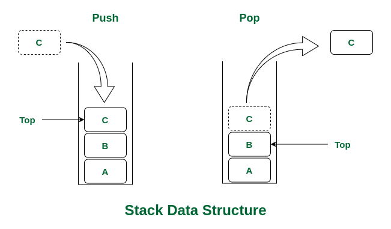

# _栈（LIFO）_

---



## Contents

- [STL](#stl)
- [顺序栈（数组实现）](#顺序栈数组实现)
- [链栈（链表实现）](#链栈链表实现)
- [应用](#应用)
- [参考资料](#参考资料)

## STL

> 头文件`<stack>`
>
> STL 模板
> `template <class Type, class Container = deque<Type> > class stack;`
>
> ```c++
> st.top()		//返回栈顶
> st.push()		//进栈
> st.pop()		//出栈
> st.empty()		//判断是否为空
> st.size()		//返回元素数量
> ```

## 顺序栈（数组实现）

```c++
//结构
class Stack
{
private:
    int top;
    int num[Size];
public:
    Stack() {this->top = -1;}           //默认构造函数
    void push(int x);                   //入栈
    int pop();                          //出栈
    int peek();                         //返回栈顶元素
    bool isEmpty();                     //判断栈是否为空
};

void Stack::push(int x)
{
    num[++ this->top] = x;
}

int Stack::pop()
{
    int x = num[this->top --];
    return x;
}

int Stack::peek()
{
    int x = num[this->top];
    return x;
}

bool Stack::isEmpty()
{
    if(this->top == -1) return true;
    else return false;
}
/////////////////////未定义错误处理//////////////////////
```

## 链栈（链表实现）

```c++
//节点结构
class Node
{
public:
    int data;
    Node *next;
    Node(int x)
    {
        this->data = x;
        this->next = nullptr;
    }
};

//栈结构
class Stack
{
private:
    Node *top;
    int count;
public:
    Stack()                             //默认构造函数
    {
        this->top = nullptr;
        this->count = 0;
    }
    void push(int x)                    //入栈
    {
        Node *New = new Node(x);
        New->next = this->top;
        this->top = New;
        this->count++;
    }
    void pop()                          //出栈
    {
        Node *t = this->top;
        this->top = this->top->next;
        delete t;
        this->count--;
    }
    int peek()                          //返回栈顶元素
    {
        return this->top->data;
    }
    void display()                      //列出栈内元素
    {
        Node *t = this->top;
        while(t)
        {
            cout << t->data << " ";
            t = t->next;
        }
        cout << endl;
    }
    int size()                          //返回栈内元素个数
    {
        return this->count;
    }
    bool isEmpty()                      //判断栈内元素是否为空
    {
        return (bool)this->top;
    }
};
////////////////////未定义错误处理///////////////////////
```

## 应用

> 1. 递归：斐波那契数列、汉诺塔
> 2. 四则运算表达式求值：逆波兰表示（RPN）中缀表达式->后缀表达式

## 参考资料
