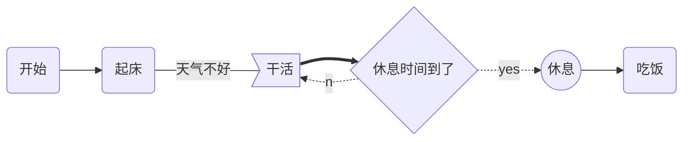

# Markdown

---

## Contents

- [前言](#前言)
- [To-Do](#to-do)
- [emoji](#emoji)
- [链接的高级操作](#链接的高级操作)
  - [内容目录](#内容目录)
  - [锚点](#锚点)
- [流程图](#流程图)
  - [标准流程图](#标准流程图)
  - [样式流程图](#样式流程图)
- [时序图](#时序图)
  - [标准时序图](#标准时序图)
  - [样式时序图](#样式时序图)
- [甘特图](#甘特图)
- [参考资料](#参考资料)

## 前言

本文仅介绍一些有关 Markdown 的高级语法知识，对于那些较为基础的请自行查阅资料，希望本文对您有所帮助。

## TO-DO

语法：

```markdown
- [ ] 待办事项...
- [x] 已完成事项...
```

展示：

- [ ] 待办事项...
- [x] 已完成事项...

## emoji

- `:emoji-code:` 语法
- 详细列表[点这里](https://www.webfx.com/tools/emoji-cheat-sheet/)
- 部分网站不支持：简书、MarkDownPad、有道云笔记、`zybuluo.com`，但 github 支持。

示例：
|写法|显示|
|:-----:|:-----:|
|`:-1:`|:-1:|
|`:smile:`|:smile:|
|`:dog:`|:dog:|

## 链接的高级操作

### 内容目录

在段落中填写 `[toc]` 以显示**全文目录结构**

### 锚点

- 锚点其实就是**页内超链接**。比如我这里写下一个锚点，点击回到目录，就能跳转到目录。 在目录中点击这一节，就能跳过来。
- 语法说明：
  在你准备跳转到的指定标题后插入锚点 `{#标记}`，然后在文档的其它地方写上连接到锚点的链接。
- 示例：`[显示内容](#标题)`

## 流程图

- 指定 `mermaid` （样式流程图）或 `flow` （标准流程图）解析语言
- 复杂图形的绘制都是使用代码块实现的，指定代码块的解析语言，按照响应的绘制语法即可实现。（时序图、甘特图同理）

### 标准流程图

基本语法：

- 模块 id=>关键字: 描述 （“描述”前面必须有空格，“=>”两端不能有空格）
- 关键字：
  - start：流程开始，以圆角矩形绘制。
  - operation：操作，以直角矩形绘制。
  - condition：判断，以菱形绘制。
  - subroutine：子流程，以左右带空白框的矩形绘制。
  - inputoutput：输入输出，以平行四边形绘制。
  - end：流程结束，以圆角矩形绘制。
- 定义模块间的流向：
  - 模块 1id->模块 2id：一般的箭头指向
  - 条件模块 id（描述）->模块 id（direction）：条件模块跳转到对应的执行模块，并指定对应分支的布局方向。

示例：

```flow
st=>start: start
ipt=>inputoutput: input x
op=>operation: x+1
cond=>condition: x>0
sub=>subroutine: 子流程
opt=>inputoutput: output x
end=>end: end

st->ipt->op->cond
cond(yes)->opt->end
cond(no)->sub->opt->end
```

```
flow
st=>start: start
ipt=>inputoutput: input x
op=>operation: x+1
cond=>condition: x>0
sub=>subroutine: 子流程
opt=>inputoutput: output x
end=>end: end

st->ipt->op->cond
cond(yes)->opt->end
cond(no)->sub->opt->end
```

### 样式流程图

基本语法：

- graph 指定流程图方向：graph LR 横向，graph TD 纵向
- 元素的形状定义：
  - id[描述] 以直角矩形绘制
  - id(描述) 以圆角矩形绘制
  - id{描述} 以菱形绘制
  - id>描述] 以不对称矩形绘制
  - id((描述)) 以圆形绘制
- 线条定义：
  - A-->B 带箭头指向
  - A---B 不带箭头连接
  - A-.-B 虚线连接
  - A-.->B 虚线指向
  - A==>B 加粗箭头指向
  - A--描述---B 不带箭头指向并在线段中间添加描述
  - A--描述-->B 带描述的箭头指向
  - A-.描述.->B 带描述的虚线连指向
  - A=\=描述==>B 带描述的加粗箭头指向
- 子流程定义：
  ```
  subgraph title
      graph direction
  end
  ```

示例：



```
mermaid
graph LR
    A(开始) -->B(起床)
    B --天气不好--- C>干活]
    C ==> D{休息时间到了}
    D -.yes.-> E((休息))
    D -.no.-> C
    E --> F(吃饭)
```

## 时序图

### 标准时序图

### 样式时序图

## 甘特图

## 参考资料

- [如何为开发项目编写规范的 README 文件（Windows），此文详解](https://www.cnblogs.com/wj-1314/p/8547763.html)
- [MarkDown 流程图全指导](https://code.z01.com/doc/mdflow.html#%E7%94%A8Gravizo%E7%AC%AC%E4%B8%89%E6%96%B9%E6%8F%92%E4%BB%B6%E7%94%BB%E6%B5%81%E7%A8%8B%E5%9B%BE)
- [Markdown 高级语法](https://www.jianshu.com/p/cf503221471b)
- [Markdown 锚点](https://www.jianshu.com/p/6571d37c8060)
